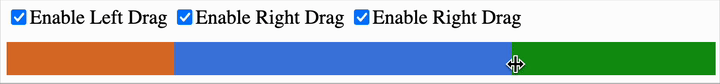

# SplitBar.js

**SplitBar.js** is a lightweight, dependency-free JavaScript module that creates dynamic, adjustable bars split into 2 or more sections.  
Users can drag handles to change the proportions between segments in real time. Ideal for surveys, UI ratings, or any situation where you need a proportional input.

---

## ⚙️ Features

- Supports 2 or more horizontal bars
- Interactive mouse-based resizing via drag handles
- Optional toggling of each handle via checkboxes
- No frameworks or external dependencies
- Simple integration with plain HTML, CSS, and JavaScript
- Compatible with all modern browsers

---

## 📦 Installation

No installation needed. Just include the files:

```html
<link rel="stylesheet" href="splitbar.css">
<script src="splitbar.js"></script>
```

---

## Example

